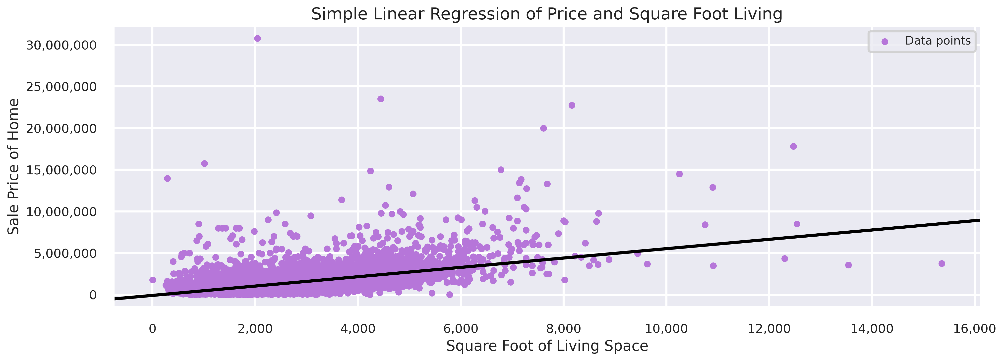

# Capstone Regression Project

## Business Understanding

Best Fit Acquisitions (BFA) is a real-estate investment firm that, on behalf of their shareholders, acquires residential properties within King County and turns a profit with each sale. BFA has allocated part of their R&D funds to hire a data analyst, myself, to identify which aspects of a home most influences its price so that they can pin point their purchasing efforts.

## Data Understanding

The data used for modeling is a CSV file which contains data for 2021-2022 home sales in King County, Washington. The file has 30,155 records and 25 fields. One record represents the sale entry for a single home. The field used as the regression target is the 'price' column which is the price of the home at the time of sale. This data was supplied by Flatiron School.

#### Analysis
First visual impressions of this simple linear regression model indicate the model does not do a very good job attempting to fit all the points as best as possible for this real world data. Also, the slope of the best fit line appears rather low. Addressing the aforementioned outliers may prove useful.

### Summary of Simple Linear Regression Model
The model is statistically significant, as well as the coefficients, with an F-statistic p-value below a presumed alpha of 0.05. However, the model only explains 37% of the variance of the dependent variable 'price'. Each additional square foot in 'sqft_living' increases 'price' by 560 dollars. According to the mean squared error, on average the model is off by 711,342 dollars.

#### Analysis
Visual impressions of this new simple linear regression model prove promising as now the best fit line has a steeper slope.

### Summary of Simple Linear Regression Model without Outliers

The model overall is statistically significant with the exception of the intercept. The model now explains 52.2% of the variance of 'price'; a 15% improvement! Each additional square foot in 'sqft_living' increases 'price' by 495 dollars. According to the mean squared error, on average the model is now off by 448,941 dollars; a 262,401 dollar improvement!

#### Fitted versus 'sqft_living' Graph
The graph above demonstrates the real values (blue) and the predicted values (red), with the particular predictor, ('sqft_living') on the x-axis. These predictions are made based on the entire model and not only the 'sqft_living' predictor which is why the predicted values are not a straight line.

### Summary of Final Multiple Linear Regression Model
This multiple linear regression model with 6 coefficients, ('sqft_living', 'sqft_above', 'sqft_basement', 'condition', 'bathrooms' and 'view'), is overall statistically significant as well as each coefficient. This model now explains 53.6% of the variance of the dependent variable 'price'. Also, according to the mean squared error, the model on average is now off by 442,054 dollars (a 1,866 dollar improvement). Below are each coefficient's effect on the target column 'price':

* 'sqft_living' adds 272 dollars to 'price' for each additional square foot
* 'sqft_above' adds 184 dollars to 'price' for each additional square foot
* 'sqft_basement' adds 125 dollars to 'price' for each additional square foot
* 'bathrooms' adds 55,190 dollars to 'price' for each additional bathroom
* 'view_Above Average' adds 263,400 dollars to 'price' for an above average view relative to a 'None' view
* 'view_Average' adds 131,200 dollars to 'price' relative to a 'None' view
* 'condition_Above Average' adds 126,200 dollars to 'price' for an above average condition home relative to a below average condition home
* 'condition_Average' adds 78,000 dollars to 'price' for an average condition home relative to a below average condition home

## Recommendations

Best Fit Acquisitions should follow the guidelines below when purchasing each property:

* Of all the aspects of a home, 'sqft_living' metric is the most important as it has a correlation to price of .72 out of -1 to 1 and is the most impactful field of the standardized fields added to the final model. BFA should purchase homes within the 50th percentile of 'sqft_living', (1930 sqft.), or higher. There are 14,627 homes that meet this qualification in the data. 
* Prioritize purchasing homes with an above average view, which out of the filtered data free from outliers is only 1199 homes. This is because an above average view of a home adds more than double ($263,400) what an average view adds to its price, (both relative to a 'None' view)
* Purchase homes of average and above average condition with equal prioritization because, unlike the 101% increase of an above average view over an average view to home price, above average condition adds only 61% more to the home price than an average condition home (again, both relative to a below average condition)
* Lastly, if a home's condition and view are both average, prioritize purchasing the home with the most bathrooms as 'bathrooms' is more impactful on home price than an average view and condition

### Next Steps

Further analysis to better understand the housing data to improve recommendations:

* **'bedrooms' effect on 'price'**. Why does 'bedrooms' have a negative impact on the price of a home when added to a multiple linear regression model?
* **A home's 'age'**. What effect, if any, does the age of a home have on its sale price?
* **Sale month of home**. Is there any relation between the month of sale and price?
